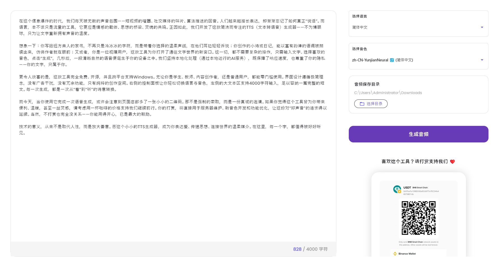

# TTS Windows Generator

一款专为 Windows 设计的文本转语音（TTS）桌面工具。输入文字即可生成自然语音，并保存为本地音频文件。

> 🇬🇧 [English Version](README.md)

## 🖼️ 应用预览

| 浅色主题 |
|----------|
|  |

## ✨ 核心功能

- **文字转语音**：输入任意中英文文本，即时生成语音。
- **双语支持**：支持简体中文与英文发音（需系统已安装对应语音包）。
- **明暗主题**：自动跟随 Windows 系统主题，视觉更舒适。
- **高清界面**：即使在 4K 屏幕上，文字依然锐利清晰。
- **本地保存**：将语音导出为 `.wav` 文件，保存到任意文件夹。
- **开箱即用**：绿色便携版，下载后直接运行，无需安装。

## 🖥️ 系统要求

- Windows 10 或 Windows 11  
- 系统已安装中/英文 TTS 语音（通常默认已存在）

> ⚠️ 本工具仅支持 Windows，不兼容 macOS 或 Linux。

## 📥 下载

从 [Releases](https://github.com/tomorrow-gif/tts-windows-generator/releases) 获取最新版本。

## ❤️ 支持开发者

如果你觉得这个工具对你有帮助，欢迎请我喝杯咖啡！  
使用币安（Binance）App 扫描下方二维码即可打赏：

你的支持将帮助我持续维护和改进这个项目。非常感谢！🙏

---